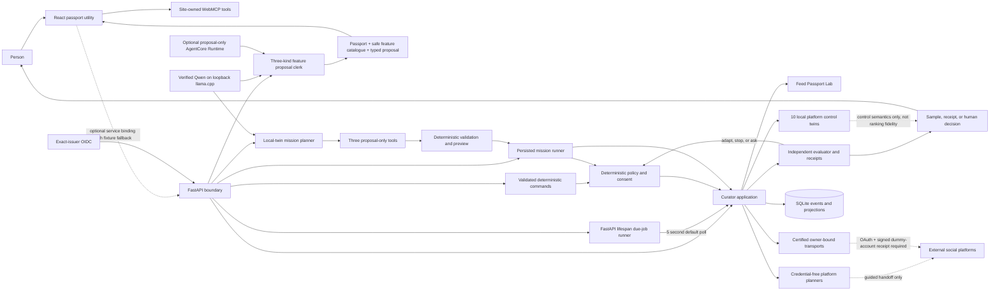

# Feed Passport

Feed Passport is an agentic control layer for recommendation feeds. A person writes the feed they want as a portable, versioned policy; the agent translates that intent into only the controls a destination declares, re-observes after acting, and stops with a rollback receipt. The complete loop runs locally in Feed Passport Lab and ten account-free platform control twins. Real external destinations remain Guided in the public default configuration. Owner-bound YouTube and Bluesky commission routes can load only the action families proven by a fresh signed dummy-account conformance receipt for the exact running revision; generic migrations still cannot execute them.

It transfers **intent**, not a platform's proprietary algorithm, embeddings, hidden ranking state, or raw private history.

**Public demo:** [feed-passport.pages.dev](https://feed-passport.pages.dev/) — a free, credential-free build that keeps external platforms visibly Guided and exercises the complete deterministic product flow without requiring a social account.

## Current proof level

This repository deliberately separates a complete local proof from future platform integrations:

- Public `main` is anchored by the sanitized 40-commit baseline at `d6727618fbe9339d1c95281806498002096dbdbd`. Work after that point is append-only. The committed evidence manifest remains the source-bound snapshot for that baseline until a new clean-tree evidence run is generated; its historical `git_pushes: 0` field is not the repository's current publication status.
- The public checkout contains no social credential, OAuth token, callback value, live-account receipt, cloud account identifier, or managed endpoint. Owner-run YouTube and Bluesky OAuth/conformance evidence, the Instagram export-import receipt, and the bounded AgentCore deployment receipt are deliberately retained only under the ignored local evidence area. Source tests never substitute for those external receipts.
- The browser can run against the real local Curator API by setting `VITE_CURATOR_API_URL`. Without a configured service, or when the initial read-only service probe cannot connect, it uses deterministic fixtures and visibly labels that mode. A connectivity loss after a mutation starts is reported as an unknown outcome and never replaced with a fabricated fixture success.
- The Python service provides the policy, consent, persistence, migration, expiry, evaluation, and rollback implementation. A client contract test verifies the browser-to-API mapping for the core Passport, checkpoint, preview, approval, and Lab execution flow.
- The standalone FastAPI app starts an autonomous due-job runner during its lifespan. It polls persisted jobs every five seconds by default, so overlays, consent slices, companion blends, and drift monitors advance without calling the manual processing endpoint.
- Feed Passport Lab is the reference closed-loop adapter. Ten additional adapters named `twin:<platform>` reuse its deterministic state engine while restricting actions to each platform profile's declared control semantics. They prove orchestration, budgeting, stop conditions, and rollback; mission rollback succeeds only when a namespaced SHA-256 fingerprint of the post-rollback local control state matches the pre-mutation baseline. They explicitly do not model a platform's private ranker.
- The default unconfigured runtime keeps all ten external platforms in credential-free Guided mode and injects one explicitly declared deterministic dummy-account snapshot per platform for capture/compilation tests. Owner-bound OAuth/vault infrastructure and candidate live transports now exist for YouTube, X, Reddit, and Bluesky, but they remain dormant unless external secrets and a fresh signed dummy-account conformance receipt allow an exact action subset to load. Loading never grants generic migration authority.
- A one-shot live-commission service can internally prioritize an already compiled YouTube or Bluesky plan within the active connection, scopes, signed certification, and fixed action budget. Its local-only model receives privacy-reduced Passport-derived demand buckets plus certified action-family names/counts and must return only a complete permutation of those families. It cannot author a goal, rationale, target, authority claim, or executable action; deterministic code applies the ordering to exact targets and seals the budgeted sequence. External model calls fail closed. Owner-authenticated API routes and the Connected Agent desk expose preview, exact approval, execution, reconciliation, cancellation, and receipt rollback, but remain fail-closed without a certified live adapter and are not by themselves live-account evidence.
- Instagram has an opt-in, loopback-only intake for a user-supplied Accounts Center-format `following.json` relationship file (direct JSON or its recognized path inside a ZIP). It stages normalized handles in a 15-minute owner-bound in-memory session and adds only the user's explicit selection to the Passport. It retains neither the raw upload nor credentials, stores a digest of the normalized selected subset rather than a raw-file digest, does not authenticate the file with Meta, infers no ranking state, and performs no Instagram API write.
- Guided migrations can continue through an owner-bound human handoff record. Each exact immutable native step must be marked `completed_by_user`, `skipped_by_user`, or `control_not_found` before explicit finalization. Its receipt is user attestation only: `api_writes=0`, `recommendation_outcomes_verified=0`, and `platform_verified=false`.
- Destination cards marked **Selected** or **Included** remain local itinerary choices. The separate Authorization Desk reports real connection state; neither a selection nor an OAuth callback is evidence that live conformance passed.
- The browser has three fresh, request-bound Strands agents behind an explicitly configured loopback-only llama.cpp provider. The Feature Clerk classifies natural language into one typed migration, Temporary Visa, or Companion proposal; the mission planner narrows one selected local twin's reversible controls; the feed-goal planner interprets sanitized owner-selected evidence. Each uses an exact three-tool proposal protocol and receives no owner or account identifier field, credentials, consent token, execution tool, or rollback authority. The feed-goal planner additionally receives no source URL or owner note.
- Feature Clerk submission tools accept categorical and numeric fields only. The model cannot author the displayed goal, purpose, rationale, partner name, authority claim, or ranking-fidelity claim. Deterministic server templates render that text, and migration proposals carry the exact server-selected capability record.
- The local provider is opt-in and fail-closed. Only `disabled` and `llamacpp` are valid modes; the configured URL must be plain HTTP on loopback, proxy inheritance is disabled, and there is no Bedrock, paid, hosted, or external-provider fallback. The deterministic preview remains available when the model is disabled, but fixture mode never presents itself as AI inference.
- The persisted runner, not the model, owns the autonomy loop after consent: observe, evaluate, plan, execute, re-observe, adapt or stop, receipt, and reverse-order rollback. Model proposals are intersected with the selected twin's reversible controls before the mission is sealed.
- A proposal-only Strands planner and hardened Amazon Bedrock AgentCore Runtime package are implemented with a plan-first CDK stack. Its strict `plan_feature` and `plan_feed` commands accept bounded typed requests; arbitrary chat/unstructured commands and every execute/approve/rollback operation are rejected. `plan_feed` receives sanitized observations and deterministic inferences without structured account-identifier fields, source URLs, credentials, authorization, or execution authority. Public metadata remains untrusted text. Managed proof is revision-bound, redacted, and local-only; the public checkout intentionally contains no reusable cloud access or managed endpoint.
- WebMCP registration exposes seven tools belonging to the Feed Passport site, including local-mission preview, inspection, and feed-evidence preview. There is intentionally no WebMCP approval or execution tool, and WebMCP does not grant access to a social-media account.

## Why this is useful

Changing accounts or platforms should not mean spending weeks retraining recommendations. Feed Passport makes a person's desired recommendation environment explicit and inspectable:

> Keep research, independent games, thoughtful design, and local culture. Preserve useful surprise, keep outrage below five percent, and never like, post, comment, repost, or message anyone to train my feed.

The same policy can support account migration, a temporary focused feed, a consent-scoped partner blend, drift detection, and creator continuity. Unsupported intent remains visible instead of being reported as success.

## Feature evidence

| Capability | What the product does | Evidence in this checkout | Boundary |
| --- | --- | --- | --- |
| Portable Feed Passport | Captures an authorized observation into normalized intent; stores topics, creator and format preferences, languages, exclusions, serendipity, outrage, and source caps; supports strict export/import and append-only checkpoints | Lab source account, declared dummy snapshots for ten external planners, capture API/agent/UI path, SQLite store, and deterministic tests | It is preference intent, not a copy of hidden ranking state; arbitrary unobserved account IDs fail closed |
| Migration | Compiles destination actions, declares translation loss, requires an owner-bound action envelope, executes against Lab/twins, or opens an exact human handoff where only native controls exist | Closed loop in Feed Passport Lab; structured missions against ten local twins; owner-bound guided-handoff state and receipts; candidate transports/recovery journals for YouTube, X, Reddit, and Bluesky | Generic migration authority cannot execute a live adapter; the separately routed owner-authenticated commission boundary is the only implemented live execution authority, and it remains fail-closed without an exact-revision live certificate |
| Instagram portability intake | Parses a user-supplied Accounts Center-format following export, previews normalized followed handles, and merges only a selected subset into creator intent | Strict JSON/ZIP parser, short-lived owner-bound session, loopback API, Passport revision path, and browser intake | Observes only followed creators; the file is not provider-authenticated, and no feed items, topics, mutes, hidden words, ranking state, login, account access, or Instagram mutation are claimed |
| Feed evidence curator | Accepts 1–12 owner-selected YouTube, Bluesky, or Instagram links plus optional owner notes; separates provider metadata from notes and deterministic inference; translates one natural-language target into a normalized mix, exclusions, and platform-specific control options | Owner-bound API, responsive Evidence desk, before/after snapshots, explicit-percentage parsing, WebMCP preview, and service/browser tests | A sample is not the full FYP. YouTube metadata needs an authorized connection, Bluesky uses public AppView, and Instagram links remain owner-note-only. Association after a change is not ranking causation |
| Temporary Visa | Applies and autonomously expires a local overlay without changing the base Passport | Deterministic domain/application/API tests, FastAPI due-job runner, live-service expiry smoke, and final Playwright issue/revoke workflow | Both current demo modes execute only in Lab; the executable mode is labeled `Reversible Lab` |
| Travel Companion | Continuously blends only explicitly selected fields after two distinct local test principals create separate expiring, revocable consent slices; either source revision refreshes the effective projection | Persistence/API tests cover two-owner consent, restart, revision propagation, expiry, revocation, effective-policy migration, and stale-preview rejection; the browser presents two deliberate local-person steps | Base Passports remain immutable; no raw histories or credentials are shared; local principals are not production authentication |
| Drift Watch | Compares an observation with the policy, proposes a correction, and can schedule an expiring alert-only or bounded Lab monitor | Deterministic evaluator, scheduler API, 14-scenario suite, and final Playwright check/correction/monitor/stop workflow | The request-bound local planner cannot schedule or mutate; bounded monitoring requires the explicit deterministic UI/API surface |
| Creator Continuity | Resolves seeded creator fixtures through a canonical synthetic directory and requires human review when no directory match exists | Studio A, Paper Lab, and City Zine map deterministically into the canonical synthetic directory; Studio A and Paper Lab use Lab lookup aliases while their cards display Bluesky | This is fixture routing, not live-platform identity verification |
| Receipts and rollback | Records scope, provenance, result, reversibility, and inverse operations | SQLite integration tests, Lab rollback evaluation, final browser receipt archive, and verified fixture/service Agent rollback flows | Platform learning that an API cannot undo must be declared |
| Agent control | Request-bound Strands agents propose feature parameters, narrow a selected twin's controls, or convert sanitized feed evidence and natural language into a typed feed target; deterministic policy remains authoritative | Each planner enforces an exact three-tool proposal protocol, strict typed output, and adversarial authority tests; AgentCore exposes proposal-only `plan_feature` and `plan_feed` paths with scripted no-network tests | No model can choose identity or account resources, receive credentials or raw source URLs, create partner consent, widen budgets or thresholds, approve itself, execute, or roll back |
| Local agent mission | Persists an outcome, acceptance target, action and iteration budgets, trace, model evidence when used, evaluations, receipts, stop reason, and rollback state | Ten local control twins, canonical model-planning API, deterministic-preview API, final desktop/mobile lifecycle, and isolated service-backed fingerprint-verified rollback | A twin tests control semantics and agent behavior, not real ranking fidelity |
| WebMCP | Lets a compatible browser agent inspect this site, open existing desks, preview a bounded local mission, and prepare a feed-evidence proposal | Seven experimental site-owned tools with registration, invocation, cleanup, validation, and graceful-fallback tests | No third-party browsing, authentication, self-approval, execution, or social-account access |

## Architecture



The domain layer is independent of Strands, AWS, HTTP, storage, and platform SDKs. A local model may submit one typed proposal. Deterministic code owns identity, resources, partner consent, authorization, action budgets, thresholds, expiry, idempotency, execution, and rollback.

## Run locally

### Browser demo

Requires a current Node.js release with npm.

```powershell
npm ci
npm run dev
```

Open `http://localhost:5173`. With no service base configured, the placard and Agent mission desk report **Deterministic demo** or **Deterministic fixture**. Use this only as an explicitly labeled, zero-credential product walkthrough.

The **Agent mission** desk is the account-free autonomy proof. Choose one of the ten platform control twins, set an outcome, acceptance thresholds, total and per-pass action limits, and a maximum pass count. **ASK LOCAL MODEL TO PLAN** uses the configured proposal-only Strands planner and displays its explicit rationale, sanitized three-tool trace, token usage, latency, and deterministic action-family admission. **PREVIEW WITHOUT MODEL** exercises the same mission boundary without claiming AI inference. Both paths stop before mutation and require a one-time approval bound to the sealed mission policy.

The global **Feature clerk** uses the same loopback-only provider through a separate typed protocol. It inspects the already selected Passport and a server-derived, non-identifying catalogue, then proposes exactly one migration, temporary visa, or companion configuration. The model returns only bounded categorical and numeric choices; deterministic code creates the visible explanation and binds a migration to the exact capability record. Applying the proposal only pre-fills the relevant desk; it does not capture an account, create partner consent, approve a plan, or execute a control.

The **Feed evidence** desk turns a small owner-selected sample into inspectable evidence instead of pretending to read a private recommender. Paste one HTTPS link per line and optionally add a note after ` | `. The service labels every field by source, derives a bounded topic estimate, parses explicit composition targets such as “60% pet science and 20% cute drawing,” turns “reduce ragebait” into a hard exclusion and tighter outrage cap, and lists what each platform can and cannot express. When the verified loopback model is ready, **ASK LOCAL STRANDS AGENT** runs a separate exact three-tool proposal protocol over sanitized evidence; the model receives no source URLs, owner notes, author/account identifier fields, credentials, consent, or execution tool. Explicit percentages stay server-locked. Capture **before**, apply the reviewed Passport revision only after local consent, then capture **after** using another sample. The comparison reports association and sampling limits; social actions remain a separate, exact-plan commission.

After consent, the persisted runner observes, evaluates, plans, acts, re-observes, and either adapts or stops; a later pass may recompile targets only within the same Passport version, approved action families, and remaining budgets. Completed runs expose receipts and a separately approved reverse-order rollback. Immediately before acting, the runner records only a hash of the deterministic local control state; it reports rollback success only when the post-rollback hash matches. A `twin:<platform>` models only that platform profile's declared control semantics on deterministic local state. It is not a ranking replica and never contacts the named platform.

### Curator API

The service requires Python 3.13.

```powershell
py -3.13 -m venv services\curator\.venv
.\services\curator\.venv\Scripts\python.exe -m pip install --upgrade pip==26.0.1
$env:PIP_CONSTRAINT = (Resolve-Path .\services\curator\constraints-py313-win.txt).Path
$env:PIP_BUILD_CONSTRAINT = $env:PIP_CONSTRAINT
.\services\curator\.venv\Scripts\python.exe -m pip install -e ".\services\curator[dev]"
Remove-Item Env:PIP_CONSTRAINT, Env:PIP_BUILD_CONSTRAINT
.\services\curator\.venv\Scripts\feed-passport-api.exe --reload
```

The constraints file freezes the exact Windows x64/CPython 3.13 dependency graph used for the recorded proof, including the isolated setuptools build backend. The runtime and build constraint variables keep both pip resolvers on that graph. Use it for a reproducible judging environment; other operating systems need their own regenerated lock because `pywin32` is platform-specific.

Open `http://127.0.0.1:8000/docs` for the API and `http://127.0.0.1:8000/api/demo` for its seeded local state. By default the service stores local SQLite state in the operating-system temporary directory. Set `FEED_PASSPORT_DB_PATH` to an explicit local path when persistence location matters.

For an app-owned service, the lifespan scheduler is enabled by default and `GET /health` reports `"scheduler": "active"`. It polls every five seconds unless `FEED_PASSPORT_SCHEDULER_INTERVAL_SECONDS` is set to another positive value. Set `FEED_PASSPORT_SCHEDULER_ENABLED=0` to disable it. Dependency-injected app instances, such as isolated tests, default to disabled unless the environment explicitly enables them. The poll interval only determines how quickly persisted due jobs are noticed; a drift monitor keeps its separately configured 15–1440 minute cadence.

For the complete local demo, keep the API running and start the browser in a second PowerShell window:

```powershell
$env:VITE_CURATOR_API_URL="http://127.0.0.1:8000"
npm run dev
```

The browser placard and Agent mission desk should now report **Local service**. If the initial read-only probe cannot connect, the client switches to visibly labeled fixtures. If a mutation response is interrupted, the client reports an unknown outcome and requires a state refresh; it does not convert the request into fixture success.

### Genuine local model planner

The supported model path is local-only and optional. Download the pinned public model and official runtime, start the verified loopback server, and set the provider variables **before** starting the Curator API:

```powershell
.\scripts\acquire-local-model.ps1
.\scripts\acquire-llama-runtime.ps1
```

In one PowerShell window:

```powershell
.\scripts\start-local-model.ps1
```

In the Curator API window:

```powershell
$env:FEED_PASSPORT_MODEL_PROVIDER="llamacpp"
$env:FEED_PASSPORT_LLAMACPP_BASE_URL="http://127.0.0.1:8080"
$env:FEED_PASSPORT_LLAMACPP_MODEL_ID="feed-passport-local-qwen3-1.7b"
$env:FEED_PASSPORT_LOCAL_MODEL_TIMEOUT_SECONDS="120"
.\services\curator\.venv\Scripts\feed-passport-api.exe --reload
```

`GET /api/agent/model/status` must report `configured: true`, `online: true`, `readiness: "ready"`, `endpoint_scope: "loopback_only"`, and both paid/external model-call flags as false. `POST /api/agent/missions/plan` is the canonical model-planning route. The compatibility alias `/api/agent/missions/model-preview` has the same behavior. The deterministic `/api/agent/missions/preview` and `/api/agent/command` boundaries remain available. `/api/agent/strands` is always disabled by design; there is no environment switch that enables broad model chat.

The downloads are ignored local artifacts and use no paid model API or competition credit. Exact provenance, hashes, proof commands, protocol boundaries, and troubleshooting are in [docs/local-agent.md](docs/local-agent.md).

## Verify the build

After installing the dependencies above, run from the repository root:

```powershell
.\scripts\check-external-readiness.ps1 -AsJson
npm test
npm run build
npm run test:sites
.\services\curator\.venv\Scripts\python.exe -m pytest services/curator/tests -o addopts= -q -p no:cacheprovider
.\services\curator\.venv\Scripts\python.exe -m evaluation --output artifacts/evaluations/feed-passport-evaluation.json
npm run test:live-service
node scripts/browser-qa.mjs --pass=final-passive-source-freeze-v1
node scripts/browser-flow-qa.mjs --run=final-fixture-source-freeze-v1
npm run test:evidence
```

`npm run test:live-service` is self-contained: it starts an owned loopback API against an owned disposable SQLite directory, runs the smoke checks, terminates the API, and removes only that directory. `npm run test:browser:platforms` likewise owns a loopback API, Vite process, random ports, and temporary database for the Instagram, YouTube, and Bluesky account-free journey. The browser child refuses an arbitrary running service and requires the API to return the exact per-run nonce and database binding before making a mutation; the runner then terminates every owned process and removes only its temporary directory.

`npm run test:evidence` is intentionally the final clean-tree gate; it fails when tracked or untracked work remains and verifies canonical indexed Git blobs rather than checkout-transformed bytes. The genuine model proof and model-enabled browser command are documented separately in [docs/local-agent.md](docs/local-agent.md). Final browser evidence is recorded in `design-qa.md`. The older general service-backed browser harness expects explicitly isolated environment variables; never point it at a stateful demo database you want to keep. Raw models, runtimes, databases, and browser runs remain ignored; submission-sized proof belongs under `artifacts/evidence/` with source binding.

The 14-scenario offline evaluation covers Passport portability and checkpoints, migration quality, public-engagement policy safety, rollback fidelity, temporary-overlay isolation and expiry, early revocation, consent-scoped companion blending, idempotency, capability honesty, the complete ten-platform local-twin matrix, the bounded agent mission lifecycle, drift detection, bounded scheduled monitoring, and creator continuity. Its JSON report identifies `deterministic_offline`, records zero external accounts and services for the twin and mission scenarios, and is not evidence of a live-platform run.

## External setup and zero-spend boundary

Run `.\scripts\check-external-readiness.ps1` for a read-only local inventory. It makes no network call, reads no token/database/AWS profile, and prints no environment value. [The external-readiness runbook](docs/external-readiness.md) gives the exact owner/provider steps for OIDC, Google/YouTube, Reddit approval, the AT Protocol sidecar, dummy-account certification, AWS SSO, Builder ID, and AgentCore. X live validation remains disabled because its API is pay-per-use. A separately authorized AgentCore proof may use the [USD 5 demonstration boundary](docs/aws-five-dollar-runbook.md), but credits and Budgets are not hard caps.

To use the local Instagram import surface, the Curator must be loopback-bound and started with `FEED_PASSPORT_ENABLE_LOCAL_IMPORT=1`. This flag authorizes only local file intake into the Passport; it does not authorize or contact Instagram.

## Platform capability truth

Every external destination exposes separate evidence views:

- The default `capabilities()` returns what the credential-free implementation has actually certified: declared snapshot input, no executable live actions, and Guided handoffs where an official interface exists. The runtime builder injects one labeled deterministic dummy snapshot per external platform; arbitrary account IDs remain unobserved and cannot be captured.
- `documented_capabilities()` records the stronger surface described by official platform documentation. It is design input for a candidate transport, not evidence that the surface is implemented, authorized, or certified.
- YouTube, X, Reddit, and Bluesky also have bounded live-transport implementations behind owner-bound OAuth credentials and an exact-revision signed conformance gate. Merely having this code or an OAuth connection does not change `capabilities()`: a fresh valid authorized-dummy-account receipt is required for planning or mutation, and generic migrations still reject live-adapter execution. Bluesky post-write verification tolerates only a bounded AppView projection delay and never replays the provider write; an unresolved result remains outcome-unknown. After a crash, an expired but otherwise valid receipt may load only a restricted observation adapter to reconcile an already-journaled uncertain write; it cannot plan, execute, replay, or roll back an action.
- The Connected Agent desk and owner-authenticated API expose the one-shot commission lifecycle for YouTube and Bluesky: preview, exact-plan approval, execution, reconciliation, cancellation, and receipt-bound rollback. Its local-only model returns only a full priority ordering of certified action families from privacy-reduced demand buckets; deterministic code chooses and seals exact targets under the fixed budget. The model receives no target, goal, rationale, approval, credential, or execution authority. Live execution still fails closed until a provider has a fresh certification receipt for this exact revision and the owner consumes one-time consent for the displayed plan.

No credential, active OAuth session, or live conformance receipt is checked into this repository. UI selection state never upgrades the runtime capability manifest.

Each named platform therefore has two deliberately separate local representations:

- `<platform>` is Guided by default. It accepts only a declared dummy snapshot and produces guided steps or translation loss unless an owner-bound deployment explicitly configures both credentials and a valid signed receipt for one of the four candidate live transports.
- `twin:<platform>` is an account-free deterministic control-surface simulator used by the persisted agent mission. It restricts execution to the profile's declared native or official controls, forbids public-engagement actions, and supports local re-observation and rollback. Its output is evidence about orchestration and policy safety, not the platform's private recommender.

| Platform | Certified here | Documented or native opportunity | Material blocker |
| --- | --- | --- | --- |
| Feed Passport Lab | Closed-loop deterministic Lab | Full local observe, execute, sample, evaluate, and rollback | It is a simulator, not a social network |
| Bluesky | Guided; live candidate unpromoted | Official AT Protocol OAuth/DPoP sidecar for follows/unfollows, actor mute/unmute, and muted-word add/remove; owner-authenticated Connected Agent lifecycle | Needs durable HTTPS sidecar deployment, authorized dummy account, and signed conformance receipt; the routes fail closed without those bindings and one-time approval; custom feeds and ranking state are not copied |
| X | Guided; zero-spend live candidate disabled | OAuth/API follows and mutes; public Phoenix code for offline research | API is pay-per-use; no authorized API for personalized For You ranking state; no live receipt |
| YouTube | Guided; live candidate unpromoted | OAuth/Data API subscription list/insert/delete; owner-authenticated Connected Agent lifecycle | Needs authorized dummy account and signed conformance receipt; the routes fail closed without those bindings and one-time approval; Home ranking, watch history, and native recommendation feedback are neither read nor written |
| Reddit | Guided; live candidate unpromoted | Approved Data API subscription controls | Needs explicit provider approval, authorized dummy account, scopes, approval-bound signed receipt; no private feed-training state |
| Instagram | Guided planner plus local import | Loopback-only parsing of a user-supplied Accounts Center-format following export; native follow/unfollow, mute/unmute, and hidden-word handoff steps | The importer stores normalized selected-subset provenance, not provider authentication; the import changes only selected Passport creator intent, while the handoff records user attestation; neither path writes or verifies the Instagram recommendation system |
| Facebook | Guided planner | Data export and native Favorites, unfollow, snooze, and feedback controls | Consumer feed preferences are native-UI controls |
| Threads | Guided planner | Regional Your Algo / Dear Algo experiences and native controls | Availability is regional/temporary; trigger behavior is not a supported write API |
| TikTok | Guided planner | Region- and approval-gated portability plus native Manage Topics | No supported feed-control write surface |
| LinkedIn | Guided planner | Regional member portability and native follow/feed preferences | Open OAuth permissions do not grant consumer feed control |
| Snapchat | Guided planner | Login Kit identity, My Data export, public profiles, and native feedback | Login Kit is identity-only; no feed-control API |

Test accounts do not override platform rules. A platform is promoted only after an authorized, live conformance run proves the level being claimed. Feed Passport never automates likes, comments, posts, reposts, or direct messages as feed-training signals.

## X Phoenix provenance

[xai-org/x-algorithm](https://github.com/xai-org/x-algorithm) is useful as an offline research reference for retrieval and ranking. It is not an API for an account's live For You feed, and the public repository explicitly replaces unavailable production data and infrastructure with synthetic reference inputs.

The repository keeps two deliberately different provenance bridges. `evaluation/x_phoenix_bridge.py` is the legacy harness for the former `phoenix/run_pipeline.py` layout. `evaluation/current_x_phoenix_bridge.py` understands the current [official Phoenix tree](https://github.com/xai-org/x-algorithm/tree/main/phoenix): it accepts only the official remote, an explicitly pinned full commit, a clean tracked manifest/reference tree, and five allowlisted synthetic generator entrypoints. It hashes all inspected sources and records command/environment evidence while hard-coding `ranking_executed: false` and `live_feed_changed: false`. Training, retrieval, ranking, and serving entrypoints are outside that bridge.

The current official checkout was inspected read-only at commit `bc8e5f0f07b31337bfdcaf690121498e00199b64`. The source-bound inspection and bridge contract tests pass, but no third-party generator execution receipt is present, so this checkout does **not** claim a current Phoenix run, trained ranker, recommendation-quality result, or live-feed effect. The deterministic Feed Passport twins remain the executable account-free demo evidence.

The deterministic Feed Passport evaluation above is separate and remains the reproducible acceptance path.

## Trust model

- The default `demo` authentication mode uses caller-supplied `actor_id` only as a deterministic loopback principal. Credentialed/live surfaces fail closed unless `oidc` is active, apart from an explicit `FEED_PASSPORT_ALLOW_INSECURE_LOOPBACK_OAUTH=1` one-person dummy-account harness that also requires a loopback bind host, loopback-only origins, and loopback client IPs. That override is never a deployment, proxy, LAN, or team authentication boundary. `oidc` validates an exact HTTPS issuer, audience/client ID, JWKS signature, scope, and expiry, derives ownership from `sub`, rejects conflicting body/query owners, and creates the signed-in owner's first Passport on demand.
- Explicit approval is required before mutation.
- Approval envelopes limit action types, destinations, counts, expiry, and stop conditions.
- The request-bound local model planner cannot schedule monitors, approve, mutate, execute, or roll back. The separate deterministic command/tool seam keeps any model-originated monitor alert-only; bounded automatic monitoring remains on the explicit local UI/API path.
- Public-engagement automation is denied even if requested.
- Credentials never enter prompts, receipts, fixtures, event payloads, browser storage, or logs. Standard OAuth tokens remain in an encrypted credential vault; AT Protocol tokens and DPoP keys remain in the isolated Node sidecar.
- Partner sharing contains only selected policy slices.
- Unsupported controls become structured translation loss.
- Receipts never claim that irreversible platform learning was undone.

## Asset provenance

No AI-generated or unprovenanced image is stored or shipped in the web application. The tactile interface uses CC0 linen and paper textures, OFL-licensed Libre Baskerville and Courier Prime fonts, and ISC/MIT-licensed Lucide icons. Source URLs, transformations, vendored license texts, and per-file hashes are recorded in [THIRD_PARTY_NOTICES.md](THIRD_PARTY_NOTICES.md).

## Agents for Humans

Feed Passport targets the **Everyday Agents** track: its primary user is a person reclaiming everyday control when changing accounts, changing platforms, or temporarily changing context. A real request-bound Strands agent performs genuine local inference through the pinned Qwen/llama.cpp path, while deterministic policy retains authority. AgentCore is an optional proposal-only Strands/Bedrock deployment seam with no execution authority, consistent with the [official overview](https://agentsforhumans.devpost.com/) and [FAQ](https://agentsforhumans.devpost.com/details/faqs).

The exact submission and scoring evidence is mapped in [docs/judging-evidence.md](docs/judging-evidence.md). The recording plan is in [docs/demo-script.md](docs/demo-script.md), and the no-secret external handoff is in [docs/external-readiness.md](docs/external-readiness.md). Entrants must still confirm eligibility, project-newness disclosures, public-repository settings, AWS Builder ID, working judge access, and the final public video against the [Official Rules](https://agentsforhumans.devpost.com/rules).

## License

MIT. See [LICENSE](LICENSE).
